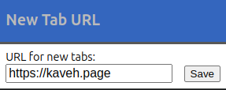

# New Tab URL

New Tab URL is a Chrome extension that allows users to set a custom URL for new tabs. Instead of the default new tab page, users can specify any URL they prefer instead of the default unchangeable default home page.

*Privacy Focused*: No ads, no tracking, and no behind-the-scenes snooping. The extension is open source and free to use. Comments are welcome. Source code available [here]().

## License

This project is licensed under the MIT License.

